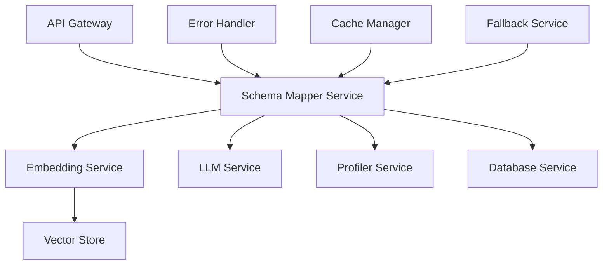

# Schema Mapper: Comprehensive Guide

## Table of Contents

1. [Overview](#overview)
2. [Architecture](#architecture)
3. [Core Services](#core-services)
4. [Features](#features)
5. [Configuration](#configuration)
6. [Error Handling](#error-handling)
7. [Performance](#performance)
8. [Best Practices](#best-practices)
9. [Examples](#examples)

## Overview

Schema Mapper is an intelligent system for mapping database schemas using embedding models, vector search, and machine learning. It combines multiple strategies to achieve accurate column mappings:

- Embedding-based similarity search
- Rule-based mapping
- LLM-powered analysis
- Data profiling
- Fallback mechanisms

## Architecture

### System Components



### Data Flow

1. **Input Processing**:

   - Source schema extraction
   - Target schema extraction
   - Sample data collection

2. **Mapping Process**:

   - Generate embeddings
   - Perform similarity search
   - Apply mapping rules
   - Profile data characteristics
   - Validate mappings

3. **Output Generation**:
   - Confidence scoring
   - Metadata storage
   - Result formatting

## Core Services

### 1. Embedding Service

```python
class EmbeddingService:
    async def generate_column_embedding(
        self,
        column_info: Dict[str, Any]
    ) -> Dict[str, Any]:
        # Generate rich text description
        # Create embedding
        # Add metadata
```

Features:

- SentenceTransformer model
- Rich text generation
- Business rules integration
- Vector similarity search

### 2. Schema Mapper

```python
class SchemaMapper:
    async def map_schemas(
        self,
        source_columns: List[Dict[str, Any]],
        target_columns: List[Dict[str, Any]]
    ) -> List[Dict[str, Any]]:
        # Orchestrate mapping process
        # Handle confidence levels
        # Manage LLM integration
```

Features:

- Mapping orchestration
- Confidence scoring
- LLM integration
- Result validation

### 3. Profiler Service

```python
class ProfilerService:
    async def profile_column(
        self,
        column_name: str,
        data_type: str,
        sample_values: List[Any]
    ) -> Dict[str, Any]:
        # Analyze statistics
        # Detect patterns
        # Assess quality
```

Features:

- Statistical analysis
- Pattern detection
- Quality assessment
- Relationship detection

### 4. Fallback Service

```python
class FallbackService:
    async def handle_failure(
        self,
        service_name: str,
        error: Exception,
        context: Dict[str, Any]
    ) -> Dict[str, Any]:
        # Choose fallback strategy
        # Apply fallback logic
        # Handle retries
```

Features:

- Multiple fallback strategies
- Retry mechanism
- Error tracking
- Performance monitoring

## Features

### 1. Intelligent Mapping

- Semantic similarity search
- Business rules integration
- Pattern matching
- Type compatibility

### 2. Data Profiling

- Statistical analysis
- Pattern detection
- Quality assessment
- Relationship inference

### 3. Error Handling

- Custom exceptions
- Retry mechanism
- Fallback strategies
- Error tracking

### 4. Performance Optimization

- Caching system
- Batch processing
- Connection pooling
- Resource management

## Configuration

### 1. Environment Variables

```env
# API Configuration
API_HOST=localhost
API_PORT=8000
API_DEBUG=false

# Database Configuration
DB_HOST=localhost
DB_PORT=5432
DB_NAME=schema_mapper
DB_USER=admin
DB_PASSWORD=secret

# Vector Store Configuration
VECTOR_STORE_PATH=./chroma_db
COLLECTION_NAME=schema_embeddings

# LLM Configuration
LLM_API_URL=http://localhost:8001
LLM_API_KEY=your_api_key

# Cache Configuration
REDIS_HOST=localhost
REDIS_PORT=6379
CACHE_TTL=3600
```

### 2. Business Rules

```python
# Healthcare field descriptions
HEALTHCARE_FIELDS = {
    "patient_id": "Unique identifier for patient records",
    "npi": "National Provider Identifier",
    "icd_code": "International Classification of Diseases code"
}

# Data type compatibility
DATA_TYPE_COMPATIBILITY = {
    "VARCHAR": ["VARCHAR", "TEXT", "CHAR"],
    "INTEGER": ["INTEGER", "BIGINT", "SMALLINT"]
}
```

### 3. Mapping Rules

```python
# Confidence thresholds
CONFIDENCE_THRESHOLDS = {
    "high": 0.8,
    "medium": 0.6,
    "low": 0.4
}

# Quality weights
QUALITY_WEIGHTS = {
    "completeness": 0.3,
    "validity": 0.3,
    "consistency": 0.2,
    "uniqueness": 0.2
}
```

## Error Handling

### 1. Custom Exceptions

```python
class SchemaMapperError(Exception):
    def __init__(
        self,
        message: str,
        details: Dict[str, Any]
    ):
        self.message = message
        self.details = details
```

### 2. Error Handler

```python
@handle_errors
async def map_schemas(
    self,
    source_columns: List[Dict[str, Any]],
    target_columns: List[Dict[str, Any]]
) -> List[Dict[str, Any]]:
    # Implementation
```

### 3. Fallback Strategies

```python
async def _fallback_embedding(
    self,
    context: Dict[str, Any]
) -> Dict[str, Any]:
    # Try cache
    # Apply rule-based matching
    # Use pattern matching
```

## Performance

### 1. Caching

```python
@cache_result(expire=3600)
async def generate_column_embedding(
    self,
    column_info: Dict[str, Any]
) -> Dict[str, Any]:
    # Implementation
```

### 2. Batch Processing

```python
async def build_vector_index(
    self,
    columns: List[Dict[str, Any]]
) -> None:
    # Process in batches
    # Update index
```

### 3. Resource Management

```python
async def __aenter__(self):
    # Acquire resources
    return self

async def __aexit__(self, exc_type, exc, tb):
    # Release resources
```

## Best Practices

### 1. Schema Mapping

- Use rich column descriptions
- Consider multiple matches
- Validate results
- Handle edge cases

### 2. Error Handling

- Implement retries
- Use fallbacks
- Log errors
- Monitor performance

### 3. Performance

- Cache common queries
- Process in batches
- Monitor resources
- Optimize searches

## Examples

### 1. Simple Mapping

```python
# Source column
source = {
    "name": "patient_id",
    "data_type": "VARCHAR",
    "sample_values": ["P123", "P456"]
}

# Target column
target = {
    "name": "id",
    "data_type": "VARCHAR",
    "sample_values": ["PAT123"]
}

# Map columns
result = await mapper.map_schemas(
    [source],
    [target]
)
```

### 2. Complex Mapping

```python
# Source columns
source_columns = [
    {
        "name": "email_address",
        "data_type": "VARCHAR",
        "sample_values": ["user@example.com"]
    },
    {
        "name": "birth_date",
        "data_type": "DATE",
        "sample_values": ["1990-01-01"]
    }
]

# Target columns
target_columns = [
    {
        "name": "email",
        "data_type": "VARCHAR",
        "sample_values": ["contact@example.com"]
    },
    {
        "name": "dob",
        "data_type": "DATE",
        "sample_values": ["1985-12-31"]
    }
]

# Map schemas
result = await mapper.map_schemas(
    source_columns,
    target_columns
)
```
