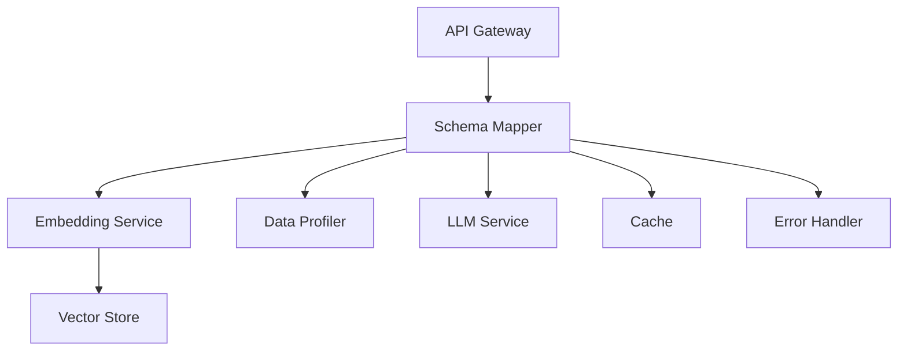
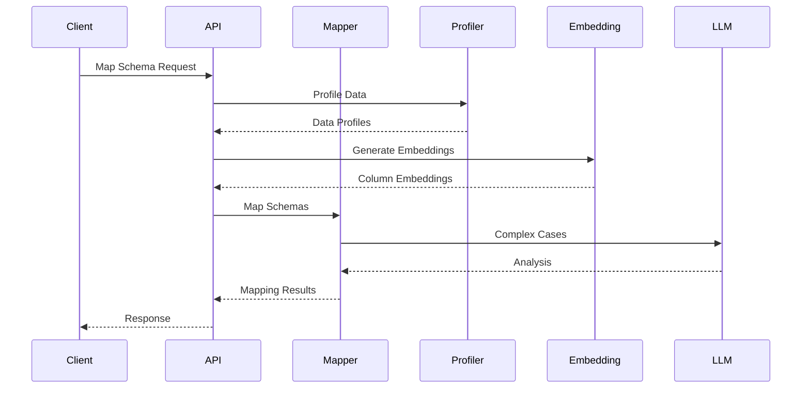

# Schema Mapper: Comprehensive Guide

## Overview

Schema Mapper is an intelligent system that automatically maps schemas between multiple source databases and a target database using embedding models, vector search, and machine learning. The system employs sophisticated profiling, fallback mechanisms, caching strategies, and error handling to ensure reliability and performance.

## Core Components

### 1. Embedding Service

The embedding service generates semantic representations of database columns using sentence transformers:

```python
# Generate column embedding
embedding = await embedding_service.generate_column_embedding({
    "name": "patient_id",
    "data_type": "VARCHAR",
    "sample_values": ["P123", "P456"]
})
```

Features:

- Semantic embedding generation
- Business rules integration
- Contextual descriptions
- Vector similarity search

### 2. Schema Mapping Service

The schema mapper orchestrates the entire mapping process:

```python
# Map schemas
result = await schema_mapper.map_schemas(
    source_columns=source_schema,
    target_columns=target_schema,
    confidence_threshold=0.8
)
```

Features:

- Multi-strategy mapping
- Confidence scoring
- Rule-based validation
- LLM integration for complex cases

### 3. Data Profiler

The data profiler analyzes source and target data:

```python
# Profile column
profile = await data_profiler.profile_column(
    column_data=data,
    column_info={"name": "email", "data_type": "VARCHAR"}
)
```

Features:

- Statistical analysis
- Pattern detection
- Quality assessment
- Type inference

### 4. LLM Service

The LLM service handles complex mapping scenarios:

```python
# Analyze mapping
analysis = await llm_service.analyze_mapping(
    source_column=source,
    target_column=target,
    current_mapping=mapping
)
```

Features:

- Complex mapping analysis
- Validation
- Transformation suggestions
- Explanation generation

## Architecture

### System Components



### Data Flow



## Configuration

### 1. Environment Variables

```bash
# .env
VECTOR_STORE_PATH=./chroma_db
LLM_API_URL=http://localhost:8000
CACHE_URL=redis://localhost:6379
```

### 2. Mapping Rules

```python
# mapping_rules.py
TYPE_COMPATIBILITY = {
    "VARCHAR": ["VARCHAR", "TEXT", "CHAR"],
    "INTEGER": ["INTEGER", "BIGINT", "SMALLINT"],
    "FLOAT": ["FLOAT", "DOUBLE", "DECIMAL"]
}
```

### 3. Profiling Rules

```python
# profiling_rules.py
THRESHOLDS = {
    "completeness": 0.95,
    "validity": 0.98,
    "consistency": 0.90
}
```

## API Reference

### 1. Schema Mapping

```http
POST /api/v1/mapping/map-schemas
Content-Type: application/json

{
    "source_schema": [...],
    "target_schema": [...],
    "confidence_threshold": 0.8
}
```

### 2. Data Profiling

```http
POST /api/v1/profiling/profile-data
Content-Type: application/json

{
    "table_name": "patients",
    "columns": [...]
}
```

### 3. Mapping Suggestions

```http
GET /api/v1/mapping/suggestions?column=patient_id
```

## Error Handling

### 1. Custom Exceptions

```python
class SchemaMapperError(Exception):
    def __init__(self, message: str, error_code: str, details: Dict = None):
        self.message = message
        self.error_code = error_code
        self.details = details
```

### 2. Error Response Format

```json
{
  "error": {
    "code": "EMBEDDING_ERROR",
    "message": "Failed to generate embedding",
    "details": {
      "column": "patient_id",
      "reason": "Invalid data type"
    }
  }
}
```

## Caching Strategy

### 1. Multi-Level Cache

```python
class CacheManager:
    def __init__(self):
        self.redis = Redis()  # Primary cache
        self.memory = TTLCache()  # Fallback cache
```

### 2. Cache Configuration

```python
CACHE_CONFIG = {
    "mapping_ttl": 3600,    # 1 hour
    "embedding_ttl": 86400, # 24 hours
    "metadata_ttl": 300     # 5 minutes
}
```

## Performance Optimization

### 1. Batch Processing

```python
async def batch_generate_embeddings(
    columns: List[Dict],
    batch_size: int = 50
):
    for batch in chunks(columns, batch_size):
        await process_batch(batch)
```

### 2. Connection Pooling

```python
DB_POOL_CONFIG = {
    "min_size": 5,
    "max_size": 20,
    "max_queries": 50000
}
```

## Monitoring

### 1. Metrics Collection

```python
metrics = {
    "mapping_latency": Histogram(),
    "cache_hits": Counter(),
    "error_rate": Gauge()
}
```

### 2. Health Checks

```python
async def check_health():
    return {
        "cache": await check_cache(),
        "vector_store": await check_vectors(),
        "llm": await check_llm()
    }
```

## Best Practices

### 1. Schema Mapping

- Profile data before mapping
- Use business rules for context
- Set appropriate confidence thresholds
- Handle edge cases gracefully

### 2. Data Profiling

- Analyze data quality
- Detect patterns and relationships
- Infer semantic types
- Validate data consistency

### 3. Error Handling

- Use appropriate error types
- Provide detailed error messages
- Implement fallback strategies
- Log errors for monitoring

### 4. Performance

- Use caching effectively
- Implement batch processing
- Monitor resource usage
- Optimize critical paths

## Examples

### 1. Basic Mapping

```python
from schema_mapper import SchemaMapper

mapper = SchemaMapper()
result = await mapper.map_schemas(source_schema, target_schema)
```

### 2. Data Profiling

```python
from schema_mapper import DataProfiler

profiler = DataProfiler()
profile = await profiler.profile_column(data, column_info)
```

### 3. Complex Mapping

```python
# Handle low confidence cases with LLM
if mapping["confidence_score"] < threshold:
    analysis = await llm_service.analyze_mapping(
        source_column,
        target_column,
        mapping
    )
```

## Troubleshooting

### Common Issues

1. **Low Confidence Mappings**

   - Check data quality
   - Verify business rules
   - Review profiling results
   - Consider LLM analysis

2. **Performance Issues**

   - Monitor cache hit rates
   - Check batch sizes
   - Verify connection pools
   - Review resource usage

3. **Data Quality Issues**
   - Run data profiling
   - Check validation rules
   - Verify data consistency
   - Update business rules

## Future Enhancements

1. **Advanced Features**

   - Schema evolution tracking
   - Automated schema migration
   - Machine learning improvements
   - Real-time mapping updates

2. **Integration Options**
   - GraphQL support
   - Streaming capabilities
   - Custom plugin system
   - External tool integration

## Contributing

1. Fork the repository
2. Create your feature branch
3. Add tests for new features
4. Submit a pull request

## License

MIT License - see LICENSE file for details.
