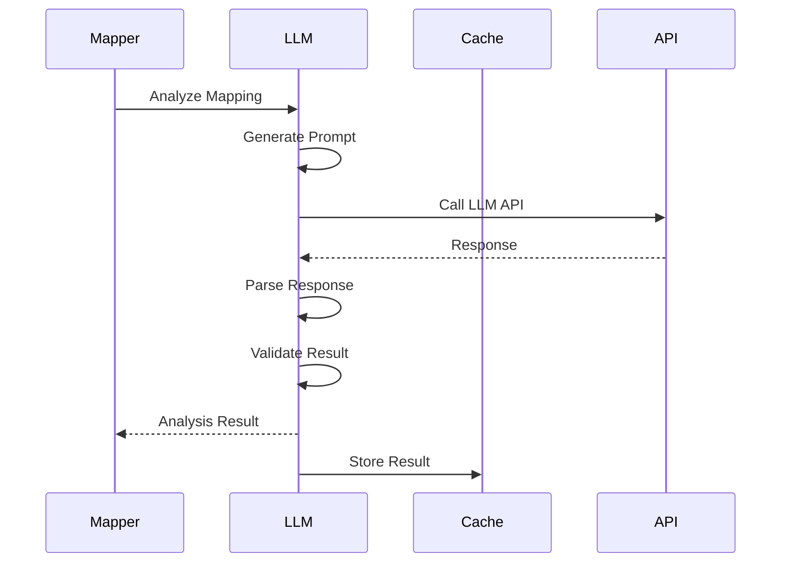
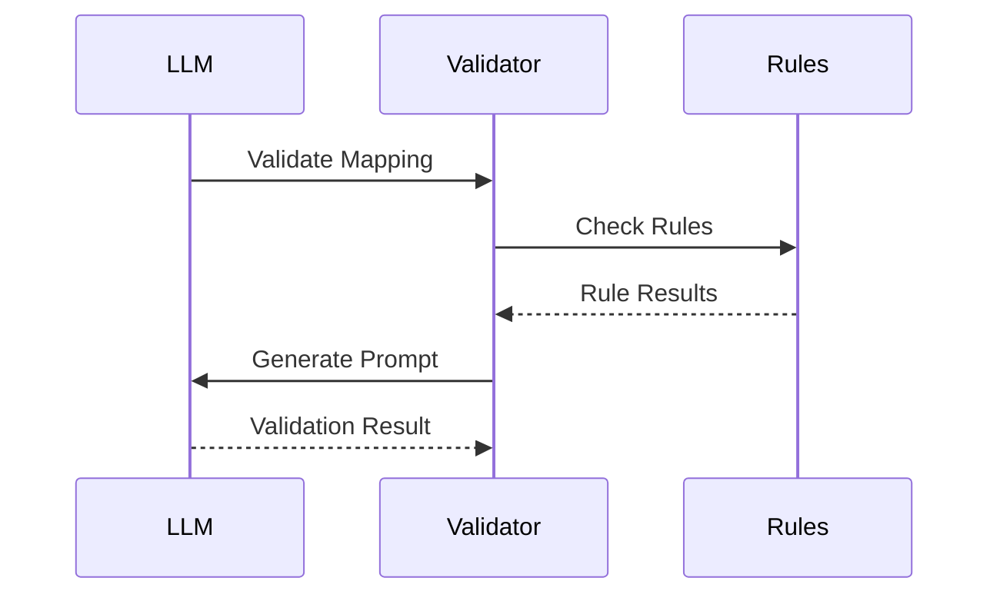

# LLM Integration

## Overview

The LLM service provides intelligent analysis for complex schema mapping scenarios that cannot be resolved through embedding similarity alone.

## Components

### 1. LLM Service

```python
class LLMService:
    async def analyze_mapping(
        self,
        source_column: Dict[str, Any],
        target_column: Dict[str, Any],
        current_mapping: Dict[str, Any]
    ) -> Dict[str, Any]:
        # Generate prompt
        # Get LLM analysis
        # Parse response
```

Key features:

- Prompt engineering
- Response parsing
- Validation rules
- Error handling

### 2. Prompt Generation

```python
def generate_mapping_prompt(
    source_column: Dict[str, Any],
    target_column: Dict[str, Any],
    current_mapping: Dict[str, Any]
) -> str:
    return f"""Analyze the following schema mapping:

Source Column:
- Name: {source_column['name']}
- Data Type: {source_column['data_type']}
- Sample Values: {source_column.get('sample_values', [])}

Target Column:
- Name: {target_column['name']}
- Data Type: {target_column['data_type']}
- Sample Values: {target_column.get('sample_values', [])}

Current Mapping:
- Rule Results: {current_mapping['rule_results']}
- Matches: {current_mapping['matches']}
"""
```

### 3. Response Processing

````python
def parse_llm_response(response: str) -> Dict[str, Any]:
    """Parse LLM response into structured format."""
    try:
        # Clean response
        response = response.strip()

        # Extract JSON
        if response.startswith("```json"):
            response = response[7:]
        if response.endswith("```"):
            response = response[:-3]

        # Parse JSON
        result = json.loads(response)

        return result

    except Exception as e:
        raise ValueError(f"Failed to parse response: {str(e)}")
````

## Integration Flow

### 1. Analysis Process



### 2. Validation Flow



## Configuration

### 1. LLM Settings

```python
llm_config = {
    "api_url": "http://localhost:8000/v1/completions",
    "max_tokens": 500,
    "temperature": 0.3,
    "timeout": 30
}
```

### 2. Prompt Templates

```python
prompt_templates = {
    "mapping_analysis": """
    Analyze the following mapping:
    Source: {source}
    Target: {target}
    Current: {current}
    """,
    "validation": """
    Validate the following result:
    Mapping: {mapping}
    Rules: {rules}
    """
}
```

### 3. Response Format

```python
response_format = {
    "analysis": {
        "confidence": float,
        "explanation": str,
        "transformations": List[str]
    },
    "validation": {
        "is_valid": bool,
        "issues": List[str],
        "suggestions": List[str]
    }
}
```

## Error Handling

### 1. API Errors

```python
try:
    result = await llm_service.analyze_mapping(
        source_column,
        target_column,
        mapping
    )
except LLMError as e:
    logging.error(f"LLM analysis failed: {str(e)}")
    return fallback_result
```

### 2. Response Validation

```python
def validate_llm_response(
    response: Dict[str, Any]
) -> bool:
    """Validate LLM response format."""
    required_fields = {
        "confidence": float,
        "explanation": str,
        "transformations": list
    }

    for field, field_type in required_fields.items():
        if field not in response:
            return False
        if not isinstance(response[field], field_type):
            return False

    return True
```

## Best Practices

### 1. Prompt Engineering

- Be specific and clear
- Include relevant context
- Structure information logically
- Use consistent formatting

### 2. Response Handling

- Validate response format
- Handle parsing errors
- Log failures
- Implement retries

### 3. Performance

- Cache common responses
- Set appropriate timeouts
- Monitor API usage
- Handle rate limits

## Examples

### 1. Simple Analysis

```python
# Analyze mapping
result = await llm_service.analyze_mapping(
    source_column={
        "name": "patient_id",
        "data_type": "VARCHAR",
        "sample_values": ["P123", "P456"]
    },
    target_column={
        "name": "id",
        "data_type": "VARCHAR",
        "sample_values": ["PAT123"]
    },
    current_mapping={
        "confidence": 0.7,
        "rule_matches": ["prefix_match"]
    }
)
```

### 2. Complex Validation

```python
# Validate complex mapping
validation = await llm_service.validate_mapping({
    "source_column": "birth_date",
    "target_column": "dob",
    "transformations": [
        "format_date('%Y-%m-%d', '%d/%m/%Y')"
    ],
    "confidence": 0.85
})
```

## Testing

### 1. Unit Tests

```python
def test_prompt_generation():
    prompt = generate_mapping_prompt(
        source_column,
        target_column,
        mapping
    )
    assert "Source Column" in prompt
    assert "Target Column" in prompt

def test_response_parsing():
    response = parse_llm_response(sample_response)
    assert "confidence" in response
    assert isinstance(response["confidence"], float)
```

### 2. Integration Tests

```python
async def test_llm_analysis():
    result = await llm_service.analyze_mapping(
        source_column,
        target_column,
        mapping
    )
    assert result["confidence"] >= 0.0
    assert result["confidence"] <= 1.0
    assert len(result["transformations"]) > 0
```

## Dependencies

- aiohttp
- pydantic
- python-jose
- cachetools

## Contributing

1. Fork the repository
2. Create your feature branch
3. Add tests for new features
4. Submit a pull request
