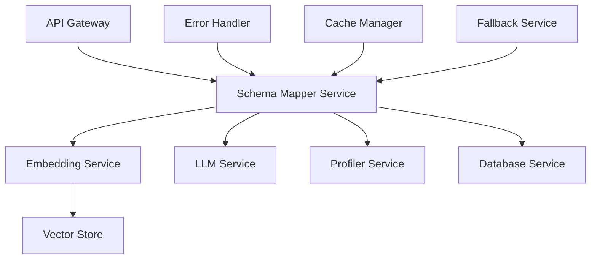
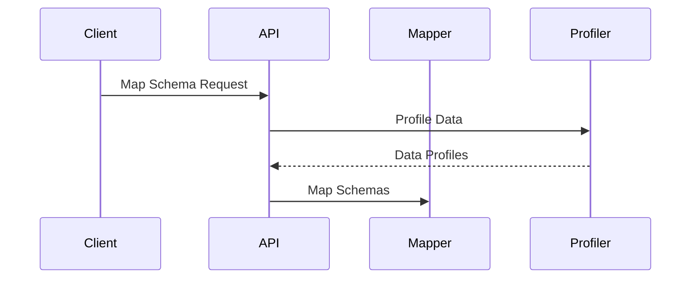
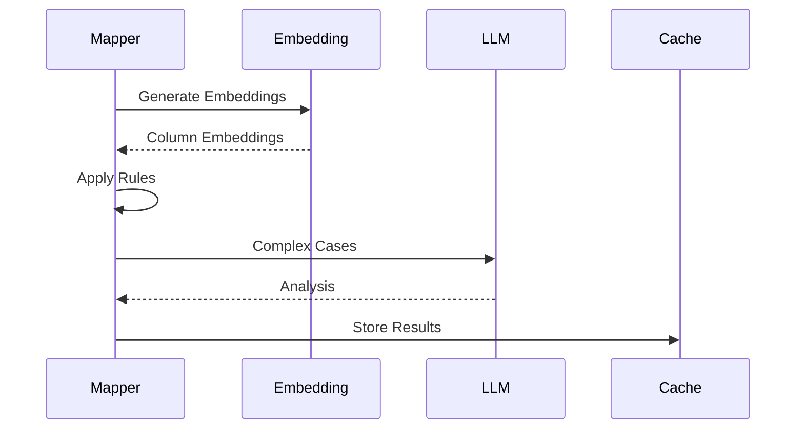
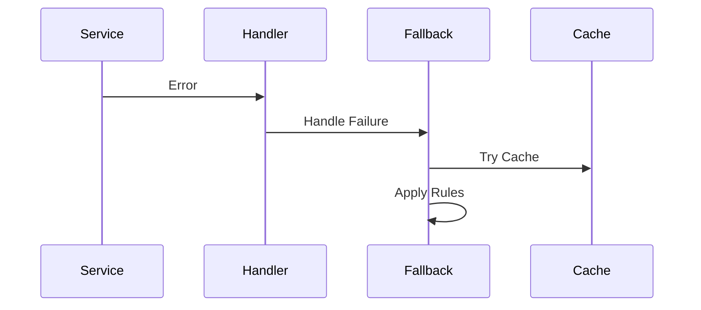
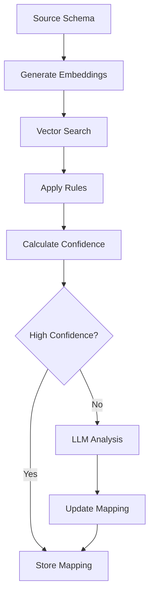
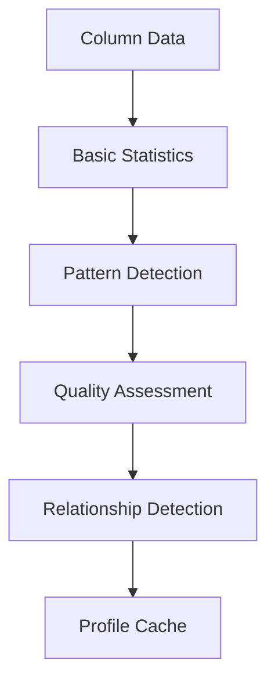
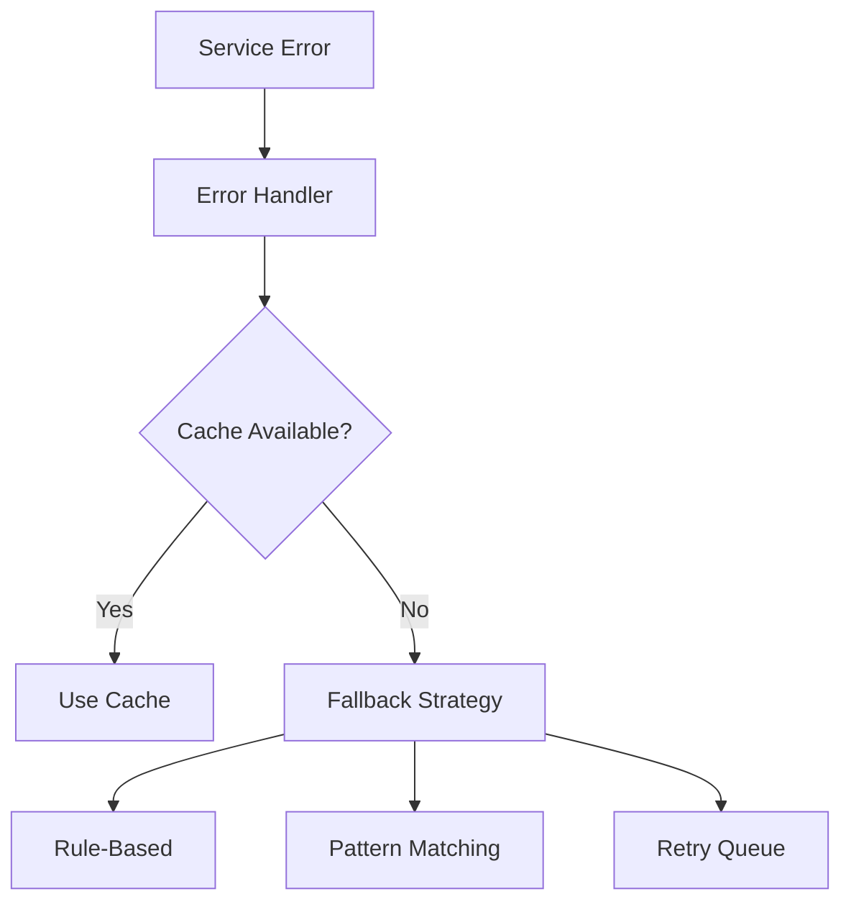

# Schema Mapping Architecture

## System Overview



## Core Components

### 1. Schema Mapper Service

The central orchestrator that coordinates the mapping process:

```python
class SchemaMapper:
    async def map_schemas(
        self,
        source_columns: List[Dict[str, Any]],
        target_columns: List[Dict[str, Any]]
    ) -> List[Dict[str, Any]]:
        # Get initial mappings
        # Process each mapping
        # Handle confidence levels
```

### 2. Embedding Service

Generates and manages semantic representations:

```python
class EmbeddingService:
    async def generate_column_embedding(
        self,
        column_info: Dict[str, Any]
    ) -> Dict[str, Any]:
        # Generate rich text
        # Create embedding
        # Add metadata
```

### 3. LLM Service

Handles complex mapping scenarios:

```python
class LLMService:
    async def analyze_mapping(
        self,
        source_column: Dict[str, Any],
        target_column: Dict[str, Any],
        current_mapping: Dict[str, Any]
    ) -> Dict[str, Any]:
        # Generate prompt
        # Get LLM analysis
        # Parse response
```

### 4. Profiler Service

Analyzes data characteristics:

```python
class ProfilerService:
    async def profile_column(
        self,
        column_name: str,
        data_type: str,
        sample_values: List[Any]
    ) -> Dict[str, Any]:
        # Analyze statistics
        # Detect patterns
        # Assess quality
```

## Data Flow

### 1. Input Processing



### 2. Mapping Process



### 3. Error Handling



## Component Interactions

### 1. Schema Mapping Flow



### 2. Data Profiling Flow



### 3. Error Recovery Flow



## Configuration

### 1. Service Configuration

```python
service_config = {
    "embedding": {
        "model": "all-MiniLM-L6-v2",
        "vector_store": "./chroma_db"
    },
    "llm": {
        "api_url": "http://localhost:8000",
        "timeout": 30
    },
    "profiler": {
        "cache_size": 1000,
        "ttl": 3600
    }
}
```

### 2. Mapping Rules

```python
mapping_rules = {
    "confidence": {
        "high": 0.8,
        "medium": 0.6,
        "low": 0.4
    },
    "thresholds": {
        "similarity": 0.7,
        "type_match": 0.5
    }
}
```

### 3. Error Handling

```python
error_config = {
    "retries": {
        "max_attempts": 3,
        "backoff": 1.5
    },
    "timeouts": {
        "embedding": 10,
        "llm": 30,
        "database": 5
    }
}
```

## Performance Optimization

### 1. Caching Strategy

```python
cache_config = {
    "embedding": {
        "ttl": 86400,  # 24 hours
        "max_size": 10000
    },
    "mapping": {
        "ttl": 3600,   # 1 hour
        "max_size": 1000
    },
    "profile": {
        "ttl": 43200,  # 12 hours
        "max_size": 5000
    }
}
```

### 2. Batch Processing

```python
batch_config = {
    "embedding": {
        "size": 50,
        "timeout": 30
    },
    "profiling": {
        "size": 100,
        "timeout": 60
    }
}
```

### 3. Resource Management

```python
resource_config = {
    "database": {
        "pool_size": 20,
        "max_overflow": 10
    },
    "vector_store": {
        "max_connections": 10,
        "timeout": 5
    }
}
```

## Monitoring

### 1. Metrics Collection

```python
metrics = {
    "mapping": {
        "latency": Histogram(),
        "success_rate": Counter(),
        "error_rate": Counter()
    },
    "cache": {
        "hits": Counter(),
        "misses": Counter(),
        "size": Gauge()
    }
}
```

### 2. Health Checks

```python
health_checks = {
    "embedding": check_embedding_service,
    "llm": check_llm_service,
    "database": check_database_service,
    "vector_store": check_vector_store
}
```

### 3. Logging

```python
logging_config = {
    "version": 1,
    "handlers": {
        "console": {
            "class": "logging.StreamHandler",
            "formatter": "json"
        },
        "file": {
            "class": "logging.FileHandler",
            "filename": "schema_mapper.log"
        }
    }
}
```

## Security

### 1. Authentication

```python
auth_config = {
    "jwt": {
        "algorithm": "HS256",
        "expire_minutes": 30
    },
    "api_key": {
        "header": "X-API-Key",
        "prefix": "Bearer"
    }
}
```

### 2. Authorization

```python
permissions = {
    "mapping": {
        "read": ["user", "admin"],
        "write": ["admin"]
    },
    "profile": {
        "read": ["user", "admin"],
        "write": ["admin"]
    }
}
```

### 3. Data Protection

```python
security_config = {
    "encryption": {
        "algorithm": "AES-256",
        "key_rotation": 30
    },
    "masking": {
        "fields": ["pii", "sensitive"],
        "method": "hash"
    }
}
```

## Deployment

### 1. Container Configuration

```dockerfile
FROM python:3.9-slim
WORKDIR /app
COPY requirements.txt .
RUN pip install -r requirements.txt
COPY . .
CMD ["uvicorn", "src.app.main:app", "--host", "0.0.0.0"]
```

### 2. Environment Variables

```env
# API Configuration
API_HOST=0.0.0.0
API_PORT=8000
API_DEBUG=false

# Database Configuration
DB_HOST=localhost
DB_PORT=5432
DB_NAME=schema_mapper

# Vector Store Configuration
VECTOR_STORE_PATH=/data/chroma_db
COLLECTION_NAME=schema_embeddings

# Cache Configuration
REDIS_HOST=localhost
REDIS_PORT=6379
CACHE_TTL=3600
```

### 3. Resource Requirements

```yaml
resources:
  limits:
    cpu: "2"
    memory: "4Gi"
  requests:
    cpu: "1"
    memory: "2Gi"
```
