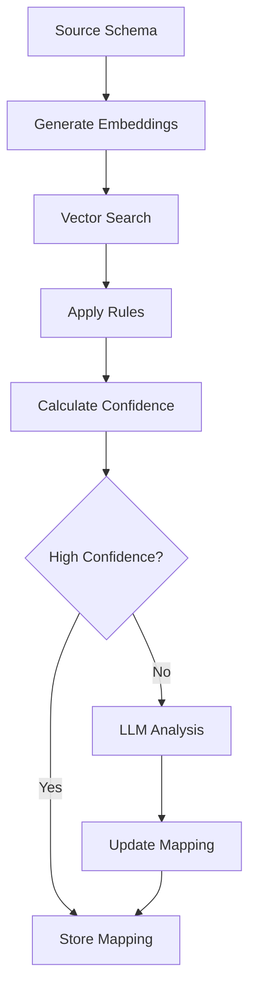

# Technical Deep Dive

## 1. Embedding Strategy

### 1.1 Column Text Generation

```python
def _build_column_text(
    column_name: str,
    data_type: str,
    sample_values: List[str]
) -> str:
    components = [
        get_field_description(column_name),
        generate_contextual_description(column_name, data_type, sample_values),
        f"Data type {data_type} compatible with: {get_compatible_types(data_type)}"
    ]
    return " | ".join(components)
```

### 1.2 Business Rules Integration

```python
# Healthcare-specific rules
HEALTHCARE_FIELDS = {
    "patient_id": "Unique identifier for patient records",
    "npi": "National Provider Identifier",
    "icd_code": "International Classification of Diseases code"
}

# Data type compatibility
DATA_TYPE_COMPATIBILITY = {
    "VARCHAR": ["VARCHAR", "TEXT", "CHAR"],
    "INTEGER": ["INTEGER", "BIGINT", "SMALLINT"]
}
```

### 1.3 Vector Store Management

```python
# ChromaDB configuration
collection = chroma_client.create_collection(
    name="schema_embeddings",
    metadata={"description": "Schema column embeddings"}
)

# Add embeddings
collection.add(
    embeddings=[embedding_vector],
    documents=[column_text],
    metadatas=[metadata],
    ids=[unique_id]
)
```

## 2. Data Profiling

### 2.1 Statistical Analysis

```python
def _analyze_numeric(self, series: pd.Series) -> Dict[str, Any]:
    return {
        "distribution": {
            "skewness": series.skew(),
            "kurtosis": series.kurtosis(),
            "is_normal": self._test_normality(series)
        },
        "ranges": self._get_numeric_ranges(series),
        "outliers": self._detect_outliers(series)
    }
```

### 2.2 Pattern Detection

```python
# Common patterns
pattern_checks = {
    "email": r"^[a-zA-Z0-9._%+-]+@[a-zA-Z0-9.-]+\.[a-zA-Z]{2,}$",
    "phone": r"^\+?[\d\-\(\)]+$",
    "url": r"^https?://\S+$",
    "zipcode": r"^\d{5}(-\d{4})?$"
}

# Pattern analysis
matches = series.str.match(pattern, na=False)
match_ratio = matches.sum() / len(series)
```

### 2.3 Quality Assessment

```python
def _assess_data_quality(self, series: pd.Series) -> Dict[str, Any]:
    return {
        "completeness": (total - null_count) / total,
        "validity": self._check_data_validity(series),
        "consistency": self._check_value_consistency(series)
    }
```

## 3. Schema Mapping

### 3.1 Mapping Process



### 3.2 Confidence Scoring

```python
def calculate_confidence(
    similarity: float,
    type_match: bool,
    rule_match: bool
) -> float:
    base_score = similarity * 0.6
    type_score = 0.2 if type_match else 0
    rule_score = 0.2 if rule_match else 0
    return base_score + type_score + rule_score
```

### 3.3 Validation Rules

```python
def validate_mapping(
    mapping_result: Dict[str, Any],
    validation_rules: Optional[Dict] = None
) -> Dict[str, Any]:
    validation = {
        "is_valid": True,
        "warnings": [],
        "errors": []
    }

    # Apply validation rules
    if mapping_result["confidence_score"] < 0.7:
        validation["warnings"].append(
            "Low confidence score"
        )

    return validation
```

## 4. LLM Integration

### 4.1 Prompt Engineering

```python
def generate_mapping_prompt(
    source_column: Dict,
    target_column: Dict,
    current_mapping: Dict
) -> str:
    return f"""
    Analyze the following mapping:
    Source: {source_column}
    Target: {target_column}
    Current: {current_mapping}
    """
```

### 4.2 Response Processing

````python
def parse_llm_response(response: str) -> Dict[str, Any]:
    # Clean response
    response = response.strip()
    if response.startswith("```json"):
        response = response[7:]
    if response.endswith("```"):
        response = response[:-3]

    # Parse JSON
    return json.loads(response)
````

### 4.3 Error Handling

```python
try:
    result = await llm_service.analyze_mapping(
        source_column,
        target_column,
        mapping
    )
except LLMError as e:
    logging.error(f"LLM analysis failed: {str(e)}")
    return fallback_result
```

## 5. Caching Strategy

### 5.1 Multi-Level Cache

```python
class CacheManager:
    def __init__(self):
        self.redis = Redis()  # Primary
        self.memory = TTLCache()  # Fallback

    async def get(self, key: str) -> Optional[Any]:
        try:
            return await self.redis.get(key)
        except RedisError:
            return self.memory.get(key)
```

### 5.2 Cache Keys

```python
# Key formats
mapping_key = f"mapping:{source}:{target}"
embedding_key = f"embedding:{table}:{column}"
profile_key = f"profile:{table}:{column}"
```

### 5.3 TTL Configuration

```python
CACHE_TTL = {
    "mapping": 3600,     # 1 hour
    "embedding": 86400,  # 24 hours
    "profile": 43200,    # 12 hours
    "metadata": 300      # 5 minutes
}
```

## 6. Error Handling

### 6.1 Custom Exceptions

```python
class SchemaMapperError(Exception):
    def __init__(
        self,
        message: str,
        error_code: str,
        details: Optional[Dict] = None
    ):
        self.message = message
        self.error_code = error_code
        self.details = details
        self.timestamp = datetime.utcnow()
```

### 6.2 Error Response Format

```python
def build_error_response(error: SchemaMapperError) -> Dict:
    return {
        "error": {
            "code": error.error_code,
            "message": error.message,
            "details": error.details,
            "timestamp": error.timestamp
        }
    }
```

### 6.3 Retry Logic

```python
@retry(
    stop=stop_after_attempt(3),
    wait=wait_exponential(multiplier=1, min=4, max=10)
)
async def call_with_retry(func, *args, **kwargs):
    return await func(*args, **kwargs)
```

## 7. Performance Optimization

### 7.1 Batch Processing

```python
async def process_batch(
    items: List[Any],
    batch_size: int = 50
):
    for batch in chunks(items, batch_size):
        async with TaskGroup() as group:
            for item in batch:
                group.create_task(process_item(item))
```

### 7.2 Connection Pooling

```python
db_pool = await asyncpg.create_pool(
    min_size=5,
    max_size=20,
    max_queries=50000,
    timeout=60
)
```

### 7.3 Resource Management

```python
async def monitor_resources():
    while True:
        metrics = {
            "cpu": psutil.cpu_percent(),
            "memory": psutil.virtual_memory().percent,
            "disk": psutil.disk_usage('/').percent
        }
        await report_metrics(metrics)
        await asyncio.sleep(60)
```

## 8. Monitoring

### 8.1 Metrics Collection

```python
metrics = {
    "mapping_latency": Histogram(
        name="mapping_latency_seconds",
        buckets=[0.1, 0.5, 1.0, 2.0, 5.0]
    ),
    "cache_hits": Counter(
        name="cache_hits_total"
    ),
    "error_rate": Gauge(
        name="error_rate"
    )
}
```

### 8.2 Health Checks

```python
async def check_health() -> Dict[str, Any]:
    return {
        "cache": await check_cache_health(),
        "vector_store": await check_vector_store_health(),
        "llm": await check_llm_health(),
        "database": await check_database_health()
    }
```

### 8.3 Logging

```python
logging.config.dictConfig({
    "version": 1,
    "handlers": {
        "console": {
            "class": "logging.StreamHandler",
            "formatter": "json"
        },
        "file": {
            "class": "logging.FileHandler",
            "filename": "schema_mapper.log",
            "formatter": "json"
        }
    }
})
```

## 9. Testing Strategy

### 9.1 Unit Tests

```python
@pytest.mark.asyncio
async def test_embedding_generation():
    service = EmbeddingService()
    embedding = await service.generate_column_embedding({
        "name": "email",
        "data_type": "VARCHAR",
        "sample_values": ["test@example.com"]
    })
    assert embedding is not None
    assert len(embedding) == 384  # Expected dimension
```

### 9.2 Integration Tests

```python
@pytest.mark.asyncio
async def test_end_to_end_mapping():
    mapper = SchemaMapper()
    result = await mapper.map_schemas(
        source_schema,
        target_schema
    )
    assert result["mappings"]
    assert result["stats"]["total_mappings"] > 0
```

### 9.3 Performance Tests

```python
@pytest.mark.benchmark
async def test_mapping_performance(benchmark):
    result = await benchmark.async_run(
        mapper.map_schemas,
        large_source_schema,
        large_target_schema
    )
    assert result["stats"]["total_time"] < 5.0  # Max 5 seconds
```
